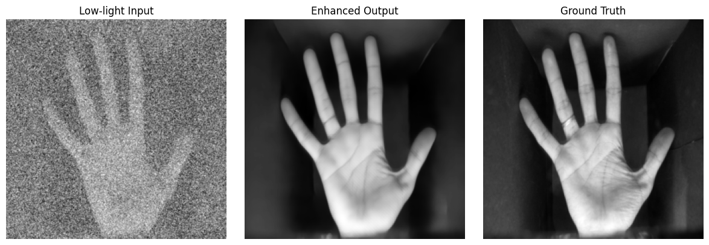

# PalmNetPlus: Recognition-Oriented Palmprint Enhancement

PalmNetPlus is a deep learning-based palmprint enhancement framework designed
for low-light and noisy biometric acquisition scenarios. The architecture
combines multi-scale convolutional feature extraction with transformer-based
global context modeling.

---

## 🔍 Key Features
- Multi-scale convolution blocks (3×3, 5×5, 7×7)
- Swin Transformer for global dependency modeling
- Channel-attention-based detail refinement
- Recognition-inspired composite loss

---

## 🧠 Architecture
**Pipeline**
Low-light Palmprint → PalmNetPlus → Enhanced Palmprint

Core components:
- Encoder–decoder with skip connections
- Swin Transformer block at bottleneck
- Detail refinement via channel attention

---

### 📄 Paper
- 📝 *Title:* **A Transformer-Guided Multi-Scale CNN Approach to Single-Channel Image Restoration**
- 🔗 *Status:* Under review  

